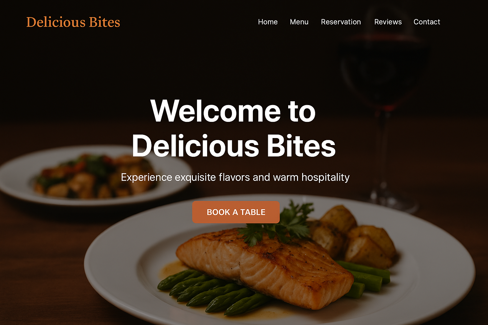
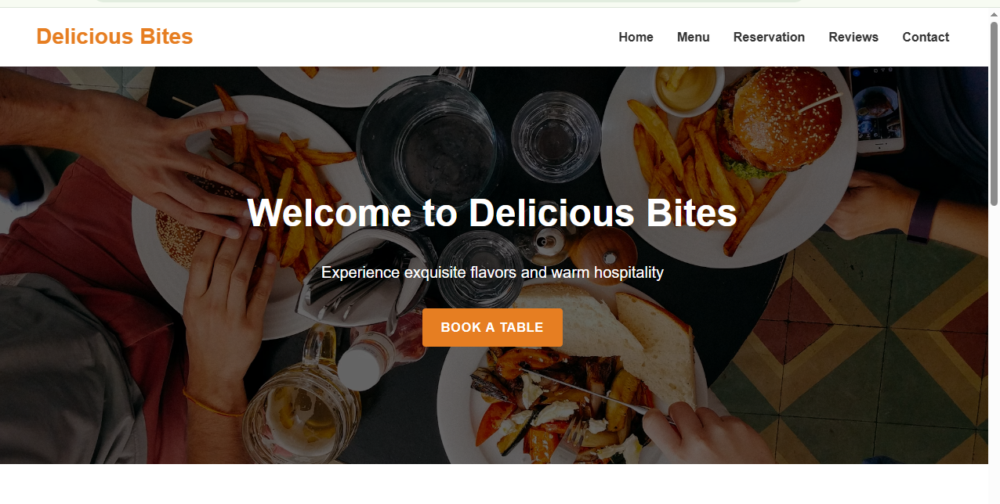
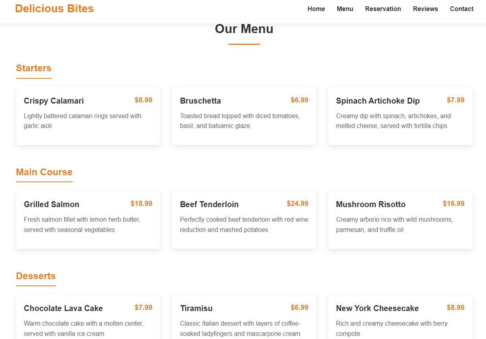

# 🍽️ Delicious Bites Restaurant Website
[](https://YOUR_USERNAME.github.io/delicious-bites-restaurant/)
[](https://github.com/YOUR_USERNAME/delicious-bites-restaurant)

A **modern, responsive restaurant website** built using **HTML**, **CSS**, and **JavaScript**.  
This project showcases a full restaurant landing page with menu listings, a reservation form, customer reviews, and contact information.

---

## 🚀 Features
- **Responsive Design** – Works seamlessly on desktop, tablet, and mobile devices.
- **Navigation Menu** – Smooth scrolling and mobile-friendly hamburger menu.
- **Menu Section** – Categorized items with prices and descriptions.
- **Reservation Form** – Simple form with basic validation.
- **Customer Reviews** – Auto-rotating review slider with manual controls.
- **Sticky Header** – Always visible navigation bar for easy browsing.
- **Interactive UI** – Hover effects and animations for an engaging user experience.

---

## 🛠️ Technologies Used
- **HTML5**
- **CSS3**
- **JavaScript (Vanilla JS)**
- **Google Fonts & Icons**
- **Responsive Web Design principles**

---

## 📂 Project Structure
Delicious-Bites/
│
├── index.html # Main HTML file
├── styles.css # CSS styles
├── script.js # JavaScript functionality
├── favicon/ # Icons and favicon
└── README.md # Project documentation


---

## 📸 Screenshots



---

## 🌐 Live Demo
🔗 **[View Live Website](https://Waleed-Abdullah-Abbasi.github.io/delicious-bites-restaurant/)**

---

## 📥 How to Use Locally
1. Clone the repository:
   ```bash
   git clone https://github.com/Waleed-Abdullah-Abbasi/delicious-bites-restaurant.git
2. Open the project folder.
3. Double-click index.html to open in your browser.

👨‍💻 Author
Waleed Abdullah
📍 Rawalpindi, Pakistan
🔗 LinkedIn | GitHub

📜 License
This project is licensed under the MIT License – feel free to use and modify it.

